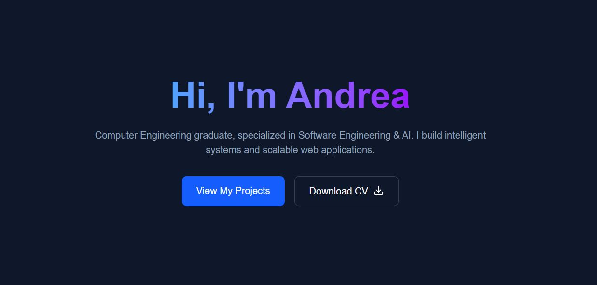

# Personal Portfolio

## Overview

This repository contains the current implementation of my personal portfolio website.

I've tried to include in it all the most relevant information related to my background and skills.

Please, notice that this is just the first stable version and the project will likely be subject to future updates.

## Languages and Tools

The website is mainly built using NextJS and TypeScript. 

Additionally the following libraries and tools have been used:

- Tailwind CSS
- React Icons
- Resend (for contact emails)
- Vercel (for deployment)